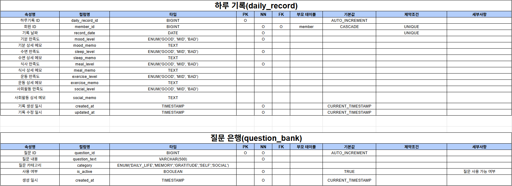
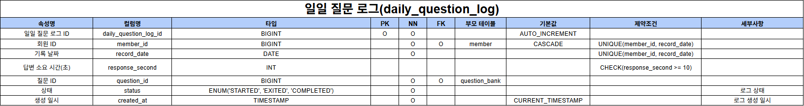
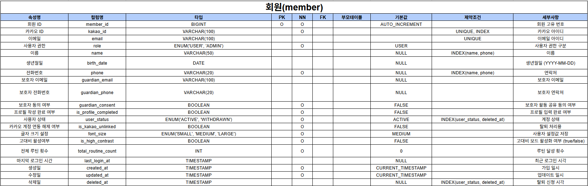
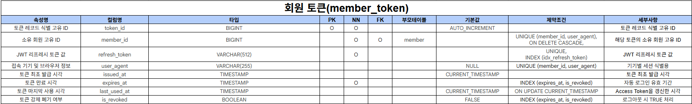
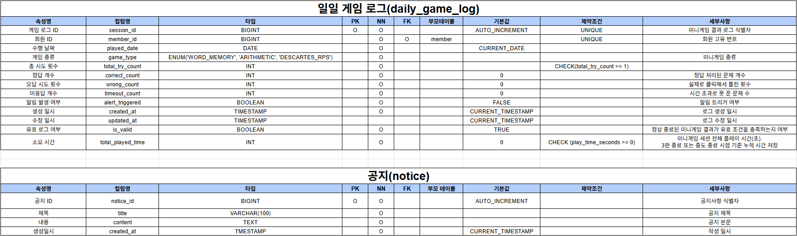
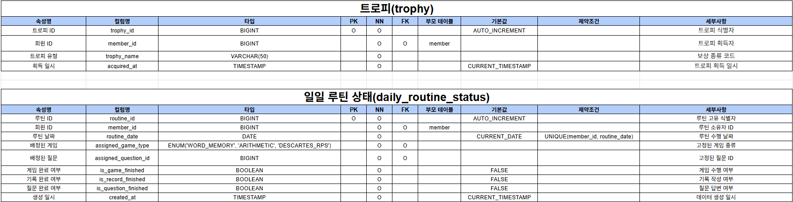
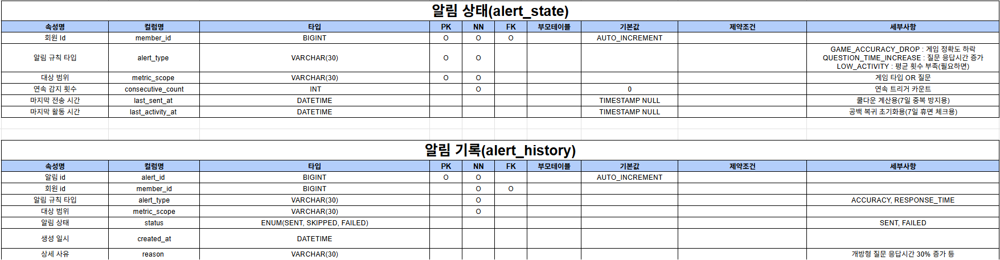
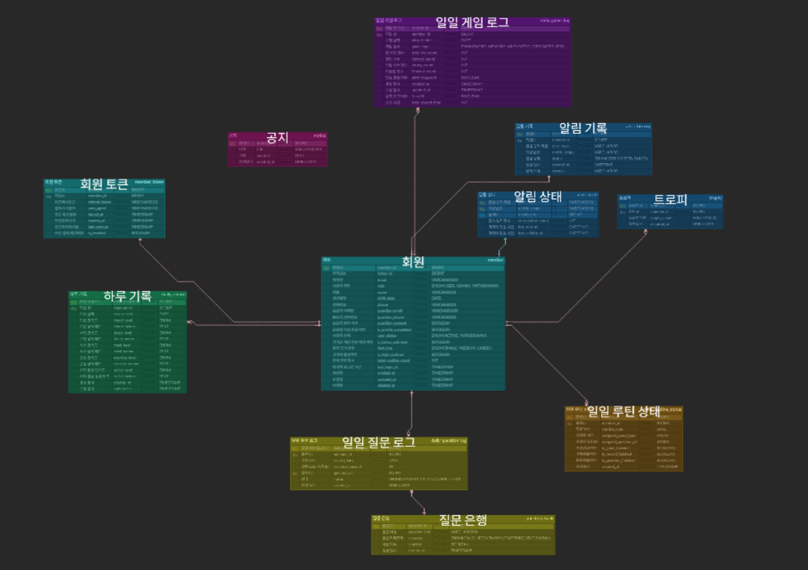

# 두뇌산책


## 👥 팀원 소개

<table style="width:100%; text-align:center;">
  <thead>
    <tr>
      <th>양준석</th>
      <th>박재하</th>
      <th>모희주</th>
      <th>윤준상</th>
      <th>이슬이</th>
      <th>조하은</th>
    </tr>
  </thead>
  <tbody>
    <tr>
      <td>
        <br>
        🔗 <a href="https://github.com/YJunSuk">YSunSuk</a>
      </td>
      <td>
        <br>
        🔗 <a href="https://github.com/horolo1234">horolo1234</a>
      </td>
      <td>
        <br>
        🔗 <a href="https://github.com/heejudy">heejudy</a>
      </td>
      <td>
        <br>
        🔗 <a href="https://github.com/wnstkd704">wnstkd704</a>
      </td>
      <td>
        <br>
        🔗 <a href="https://github.com/0lthree">0lthree</a>
      </td>
      <td>
        <br>
        🔗 <a href="https://github.com/haeuniiii">haeuniiii</a>
      </td>
    </tr>
  </tbody>
</table>

<br>

## 📍 목차

1. [프로젝트 개요](#1-프로젝트-개요)
2. [배경 및 필요성](#2-배경-및-필요성)
3. [WBS](#3-WBS)
4. [기술 스택](#4-기술-스택)  
5. [시스템 아키텍처](#5-시스템-아키텍처)
6. [프로젝트 구조](#6-프로젝트-구조)
7. [요구사항 정의서](#7-요구사항-정의서)  
8. [테이블 정의서](#8-테이블-정의서)  
9. [ERD](#9-ERD)
10. [화면 및 기능 설계서](#10-화면-및-기능-설계서)
11. [API 명세서](#11-API-명세서)  
12. [테스트 보고서](#12-테스트-보고서)
13. [회고](#13-회고)

<br>

## <a id="1-프로젝트-개요"></a> 1. 프로젝트 개요  

본 프로젝트는 치매 예방을 목적으로 하는 웹사이트를 개발하는 것을 목표로 한다.


최근 인구 고령화가 빠르게 진행되면서 치매 환자 수 또한 지속적으로 증가하고 있으며, 이에 따라 개인과 사회가 부담해야 하는 경제적·사회적 비용 또한 점점 커지고 있다. 이러한 문제를 예방적인 관점에서 접근하기 위해, 사용자가 일상 속에서 간단한 두뇌 활동을 꾸준히 수행할 수 있도록 돕는 웹 기반 서비스를 기획하였다.

본 웹사이트는 사용자에게 매일 미션 3가지를 제공하여 지속적인 두뇌 활동을 유도한다. 제공되는 미션은 미니 게임, 개방형 질문, 하루 기록으로 구성되어 있으며, 각각의 활동을 통해 기억력과 사고력 등을 자극하고 자신의 일상생활을 돌아볼 수 있도록 설계하였다.

먼저 미니 게임은 문제의 지시사항을 읽고 그에 맞는 정답을 선택하는 방식으로 진행되며, 사용자가 간단한 문제 해결 과정을 통해 두뇌를 활용하도록 돕는다. 개방형 질문은 사용자가 단순한 단답형 답변이 아닌 자신의 과거 경험이나 기억을 떠올리며 서술하도록 유도하여 회상 능력과 사고 활동을 촉진한다. 마지막으로 하루 기록은 사용자가 자신의 하루를 돌아보며 오늘의 기분, 식사, 수면 등 생활 패턴을 기록하도록 하여 일상에 대한 인식과 자기 성찰의 시간을 갖는다.

이와 같은 기능을 통해 사용자가 일상 속에서 자연스럽게 두뇌 활동을 지속할 수 있도록 하여 치매 예방에 긍정적인 영향을 줄 수 있는 웹 서비스를 제공하고자 한다.

<br>

## <a id="2-배경-및-필요성"></a> 2. 배경 및 필요성

중앙치매센터[[1]](https://www.nid.or.kr/info/dataroom_view.aspx?bid=317)에 따르면, 전국 65세 이상 추정 치매 환자 수는 2019년 이후 매년 증가하는 추세를 보이며 2023년에는 약 87만 명으로 전년 대비 약 5.1% 증가한 것으로 나타났다.


치매 환자의 증가와 함께 경제적 부담 또한 큰 문제로 대두되고 있다. 치매 환자 1인당 연간 관리 비용은 연간 가구 소득의 약 43.8%에 해당하는 수준으로 나타나 개인과 가족에게 상당한 부담이 되고 있다. 향후 고령 인구의 증가와 함께 치매 환자 수 역시 지속적으로 증가할 것으로 예상되기 때문에, 치매를 치료하는 것뿐만 아니라 사전에 예방하는 것이 매우 중요하다.


치매 예방을 위해서는 낱말 맞추기, 글쓰기, 문화 및 취미 활동과 같이 뇌세포를 지속적으로 자극할 수 있는 두뇌 활동을 꾸준히 수행하는 것이 중요한 것으로 알려져 있다. 특히 이러한 활동을 즐겁고 지속적으로 수행하는 것이 장기적인 예방 효과에 긍정적인 영향을 줄 수 있다.

이에 본 프로젝트에서는 사용자가 일상생활 속에서 부담 없이 참여할 수 있는 웹 기반 치매 예방 서비스를 기획하였다. 사용자가 매일 간단한 미션을 수행하면서 지속적인 두뇌 활동을 유도하고 치매 예방에 도움을 줄 수 있는 환경을 제공하고자 한다.

<br>

## <a id="3-wbs"></a> 3. WBS

<details>
<summary><b>🗓️ WBS 링크 </b></summary>

- 🗓️ [WBS (링크)](https://docs.google.com/spreadsheets/d/1cGxKolGeDWGtzUYxWShYSNCS0KK_gclYAco5hxDQDqI/edit?gid=1086471579#gid=1086471579)
</details>
<br>

## <a id="4-기술-스택"></a> 4. 기술 스택


### FRONTEND


### BACKEND


### DATABASE


### DEPLOYMENT


### FRAMEWORKS, PLATFORMS, LIBRAIRES


### DOCUMENTATION


<br>

## <a id="5-시스템-아키텍처"></a> 5. 시스템 아키텍처

<details>
<summary><b>🧱 시스템 아키텍처 펼쳐보기</b></summary>

</br>

</details>
<br>


## <a id="6-프로젝트-구조"></a> 6. 프로젝트 구조

<details>
<summary><b>📁 폴더 구조 펼쳐보기</b></summary>

```txt
 
src
  ├─main
  │  ├─java
  │  │  └─com
  │  │      └─rememberme
  │  │          └─dunoesanchaeg
  │  │              ├─analysis
  │  │              ├─calendar
  │  │              ├─common
  │  │              │  ├─exception
  │  │              │  └─security
  │  │              ├─config
  │  │              ├─contents
  │  │              ├─member
  │  │              ├─memory
  │  │              ├─routines
  │  │              ├─statistics
  │  │              ├─support
  │  │              └─trophies
  │  └─resources
  │      └─mapper
  └─test
```
</details>
<br/><br/>


## <a id="7-요구사항-정의서"></a> 7. 요구사항 정의서

<details>
<summary><b>🗒️ 요구사항 정의서 링크</b></summary>

- 🗒️[요구사항 정의서 (링크)](https://docs.google.com/spreadsheets/d/1cGxKolGeDWGtzUYxWShYSNCS0KK_gclYAco5hxDQDqI/edit?gid=1415182395#gid=1415182395)
</details>
<br>


## <a id="8-테이블-정의서"></a> 8. 테이블 정의서

<details>
<summary><b>🗄️ 테이블 정의서</b></summary>
</br>
</br>
</br>
</br>
</br>
</br>
</br>
  
- 🗄️[테이블 정의서 (링크)](https://docs.google.com/spreadsheets/d/1W4umq2TJ3RlpNsyxd6Db3YlDfhOW4DBUH2VfQkSFBGc/edit?gid=0#gid=0)

</details>
<br>

## <a id="9-ERD"></a> 9. ERD

<details>
<summary><b>📌 ERD 구조도</b></summary>
</br>
  
- [📌 ERD 구조도 (링크)](https://www.erdcloud.com/d/puoaE8Gz75mCg6pJt)
  
</details>
<br>

## <a id="10-화면-및-기능-설계서"></a> 10. 화면 및 기능 설계서

<details>
<summary><b>📱 화면기능 설계서 링크</b></summary>
  
- [📱 화면기능 설계서 (링크)](https://www.figma.com/design/gyX3NlACpQIADuk9ZCbxI5/두뇌산책?node-id=202-78&p=f&t=aJAPNPAJ4FySe4Zt-0)

</details>
<br>

## <a id="11-API-명세서"></a> 11. API 명세서

<details>
<summary><b>📋 API 명세서 링크</b></summary>
  
- [📋 API 명세서 (링크)](https://www.notion.so/API-308dd863c93280e2808fdca71cc4adde)

</details>
<br>

## <a id="12-테스트-보고서"></a> 12. 테스트 보고서(스프레드 시트)

<details>
 <summary><b>🧾 백엔드 테스트</b></summary>

- [🧾 백엔드 테스트 결과서 (링크)](https://docs.google.com/spreadsheets/d/1cGxKolGeDWGtzUYxWShYSNCS0KK_gclYAco5hxDQDqI/edit?gid=211938515#gid=211938515)

</details>
<br>

## <a id="13-회고"></a> 13. 회고

|   이름   |     회고 내용     |
|-----------|-----------------|
|      양준석      |     이번 프로젝트를 진행하면서 좋았던 부분은 팀원들 각자 역할을 분배 받아 맡은 일을 잘 수행하여 프로젝트를 완성한 점이라고 생각한다. 그리고 설계했던 부분들의 방향성을 잃지 않고 설계에 많은 시간을 투자한 만큼 결과물이 잘 나와서 다행이라고 생각한다. 하지만 디테일한 부분에서 문제점이 많았다. 용어 정리와 한두 개 정도의 기능 논의 사항을 자료로 통일하지 못해 개발 진행 시 모두가 동일한 생각으로 진행하지 않은 것 같다. 그 때문에 프로젝트를 마무리할 때 꽤 많은 리팩토링을 해야 한 점이 아쉬웠다. 그리고 하고 싶은 계획은 있었지만 진행하지 못한 것들이 많다. 트러블 슈팅과 백로그 작성 등 프로젝트 기획 부분과 중간 회고 작성 같은 다양한 부분을 프로젝트 진행 시간이 부족해 하지 못한 것이 많이 아쉽다. 최종 프로젝트에서는 주어지는 시간이 많으니 이 중 절반 이상이라도 시도해보고 싶은 욕심이 있다.    |
|      박재하      |     이번 두뇌산책 프로젝트에서 Java 21 및 Spring Boot 기반 백엔드 아키텍처부터 Vue.js 프런트엔드, AWS 클라우드 배포까지 전 과정을 수행하며 많은 것들을 배울 수 있었다. 보안 강화를 위해 Kakao OAuth 2.0 기반의 RTR인증 체계를 구축하고, HttpOnly 쿠키 및 User-Agent 검증 로직을 도입해 멀티 디바이스 환경에서의 토큰 탈취 위험을 차단했다. 또한 BaseException과 전역 예외 처리기를 통해 서버 가용성을 극대화하는 고가용성 아키텍처를 구성했으며, 30일 유예 기간을 둔 Soft Delete와 스케줄러 기반의 회원 관리 시스템으로 비즈니스 로직의 견고함과 사용자 경험을 동시에 확보했다.<br>인프라 설계에서는 ALB를 활용해 전 구간 HTTPS 통신을 강제하고, S3와 CloudFront(OAC) 연동을 통해 보안성과 엣지 캐싱을 통한 성능 최적화를 동시에 달성했다. SSM Parameter Store를 통한 환경변수 중앙 관리와 보안 그룹 기반의 RDS 접근 통제로 인프라 보안의 구현했다. 또한 CloudWatch를 도입해 실시간 모니터링 환경을 만들고 실시간으로 조회할 수 있도록 했다. 다음 프로젝트때는 Auto Scaling 및 NAT Gateway를 구성해서 더 높은 차원의 보안과 고가용성 설계를 해보고 싶다.  |
|      모희주      |     이번 프로젝트에서는 이전 프로젝트와 달리 기능별로 역할을 나누어 진행했다. 한 사람이 하나의 작업을 전담하는 방식보다, 여러 사람이 작업을 나누어 함께 맡는 방식이 더 효과적이라는 것을 느꼈다. 이를 통해 다양한 작업을 경험하며 많은 것을 배울 수 있었다. 프론트엔드는 기본 지식을 갖추고 있어 비교적 수월하게 진행할 수 있었지만, 백엔드는 처음 접하는 분야라 용어에 대한 이해도가 낮아 어려움을 겪었다. 특히 API 명세서를 작성하는 과정에서 가장 큰 어려움을 느꼈으나, 관련 용어를 정리하고 공부하면서 점차 이해도를 높일 수 있었다. 또한 이번 경험을 통해 기록의 중요성을 크게 깨달았다. 기록을 충분히 남기지 않아 프로젝트 로직과 관련해 팀원 간 혼선이 발생했고, 이를 해결하는 데 많은 시간이 소요되었다. 앞으로는 체계적인 기록과 공유를 통해 팀워크를 더욱 강화해야겠다고 느꼈다.     |
|      윤준상      |     이번 프로젝트를 통해 가장 중요하게 고민한 부분은 데이터베이스 설계 중 데이터를 DB에 별도로 저장할지, 아니면 조회 시점에 원본 데이터를 가져와 백엔드에서 계산할지”였다. 이렇게 설계한 이유는 통계 수식이나 기준이 변경될 가능성 있는 값들은 원본 데이터만 유지하고 MyBatis를 통해 필요한 기록을 조회한 뒤 Java에서 유연하게 계산할 수 있게 하는것이 적합하다고 생각했다. 반면 트로피 도메인에서는 단순 계산값이라기보다 “사용자가 특정 조건을 달성했는가”라는 상태 정보의 성격이 강하기 떄문에 한 번 확정된 달성 이력은 저장하는 편이 적절하다 판단했다. 이 과정을 통해 무조건적인 정규화나 저장이 정답이 아니라, 시스템의 트래픽과 비즈니스 요구사항에 따른 유연한 설계가 중요하다는 것을 생각하게 되었다.    |
|      이슬이      |     지난 프로젝트에서는 요구사항 정의부터 테이블 명세서 작성, 데이터베이스 설계까지 전반적인 과정을 경험했다. 이를 바탕으로 이번 프로젝트에서는 실제 서비스 기능 구현을 목표로 백엔드 개발을 진행했다. API 명세서를 작성하면서 클라이언트와 서버가 어떻게 소통하는지 이해할 수 있었고, 각 API가 호출될 때 어떤 데이터가 필요한지에 대해서도 깊이 고민해볼 수 있었다. 이 과정을 통해 데이터베이스 설계가 얼마나 중요한지 다시 한 번 느끼게 되었다. 그리고 백엔드 로직을 구현하기 위해 Java와 Spring Boot를 배웠는데, 지금까지 배운 언어 중 가장 복잡하게 느껴졌다. 특히 객체 지향 개념은 흥미로우면서도 어려웠지만, 실제 개발 과정에서 여러 객체가 협력해 하나의 기능을 만들어가는 모습을 보며 점점 이해할 수 있었다. 또한 개발 과정에서는 협업의 중요성도 크게 느꼈다. 원활한 소통과 역할 분담이 프로젝트의 완성도에 큰 영향을 미친다는 것을 직접 경험할 수 있었던 시간이었다.  |
|      조하은      |     이번 프로젝트를 통해 예외처리를 체계적으로 설계하는 것이 얼마나 중요한지 직접 느낄 수 있었다. 사용자 입장에서 서비스를 사용하는 상황을 고려하다 보니 입력값 검증, 중복 처리, 잘못된 요청 대응 등 다양한 예외 케이스를 처리하게 되었고, 그 과정에서 구현 범위가 과도하게 확장되는 어려움도 있었다. 이를 위해 BaseException을 기반으로 커스텀 예외를 정의하고, Global Exception Handler로 예외를 일관된 방식으로 처리했으며, 팀원들과의 지속적인 피드백을 통해 우선순위를 조정하며 적절한 수준으로 기능을 완성할 수 있었다. <br> application-local.yml을 활용해 환경별 설정을 분리하면서, 로컬과 서버 환경을 각각 고려한 개발 방식도 익힐 수 있었다. <br> Git을 활용한 협업에서는 브랜치 생성과 병합 과정에서 직접 충돌을 해결하며 버전 관리의 중요성을 체감했다. 특히 CLI 환경에서 git add, commit, push 등의 명령어를 직접 입력하다 보니 Git의 동작 원리가 훨씬 잘 이해되었고, 이전보다 한층 능숙하게 협업을 진행할 수 있게 되었다. 코드 리팩토링을 꾸준히 진행한 점과 게임 파트에서의 트러블 슈팅 경험은 앞으로의 개발에도 큰 도움이 될 것 같아 뿌듯하다. 이번 프로젝트를 거치면서 백엔드 개발 전반에 대한 이해가 깊어졌다.  |

<br>
